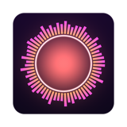
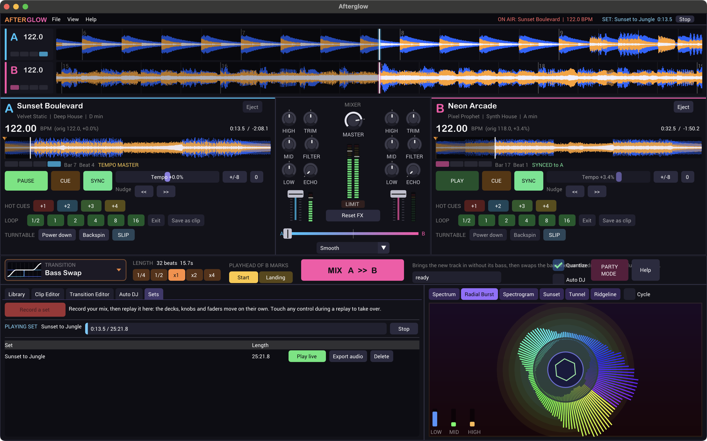

<p align="center">
  
</p>

<h1 align="center">Afterglow</h1>

<p align="center">
  A two-deck DJ app that's fun from the very first minute.<br>
  It comes with its own music, so you can start mixing before you own a single track.
</p>

<p align="center">
  <a href="https://github.com/groverburger/afterglow/releases/latest"></a>
  <a href="https://github.com/groverburger/afterglow/actions/workflows/build.yml"></a>
  
</p>

<p align="center">
  
</p>

Most DJ software assumes you already know what you're doing and already own a
crate of records. Afterglow comes at it from the other side. It ships with a library of house, techno and drum &
bass that it generates itself, it keeps everything on the beat for you, and
when you're ready to try a transition, there are sixteen of them one click
away. Once you're comfortable, point it at your own music folder and keep
going.

## Download

Grab the latest build from the [Releases page](https://github.com/groverburger/afterglow/releases/latest):

| Platform | File | |
|---|---|---|
| **Windows** 10/11 | `Afterglow-<version>-windows-x64.zip` | Unzip anywhere and run `Afterglow.exe`. Nothing to install. |
| **macOS** 11+ | `Afterglow-<version>-macos.dmg` | Drag Afterglow into Applications. Runs natively on Apple Silicon and Intel. |
| **Linux** | | [Build from source](#building-from-source). It only takes a minute. |

The builds aren't code-signed yet, so your computer will be a little
suspicious the first time:

- **Windows:** if SmartScreen shows "Windows protected your PC", click
  **More info**, then **Run anyway**.
- **macOS:** right-click the app and choose **Open**. On newer versions of macOS
  you may need **System Settings → Privacy & Security → Open Anyway**.

## What you can do

### Mix right away

Two decks, a mixer and a crossfader, laid out the way you'd expect. Sync and
quantize are on from the start, so play, cue points, loops and transitions
all land on the beat. Every track is loudness-matched and the master output
runs through a limiter, so nothing ever blows out your speakers.

Each deck has play and cue, sync, a tempo slider with nudge buttons, four hot
cues, beat loops from 1/2 to 16 beats, and the classic turntable moves:
power down and backspin. The scrolling waveforms are colored by frequency, so
you can see the kick drums and the basslines coming.

### Scratch

Grab a waveform and drag it. The record follows your hand, forwards or
backwards, and picks up from where you let go. Hold still and it stops like a
hand resting on vinyl. Turn on **SLIP** and the track keeps running
underneath while you scratch, so you drop back in exactly on the beat.

### Shape the sound

Every channel has a 3-band EQ with kills, a filter knob that sweeps from
low-pass to high-pass, a tempo-synced ping-pong echo, a trim and a fader. The
crossfader has three curves. Double-click any knob or fader to reset it, and
if things get wild, **Reset FX** puts everything back.

### Transitions at the press of a button

Pick a transition, press **MIX**, and Afterglow waits for the next bar,
matches the beats and works the mixer for you. You can watch the knobs move
(they turn yellow while the transition has them). There are sixteen to choose
from:

> Smooth Crossfade · Bass Swap · Filter Sweep · Echo Out · Backspin ·
> Power Down · Quick Cut · Long EQ Blend · Wash Out · Tempo Ramp · Loop Roll ·
> Power Swap · Three-Band Swap · Chop In · Riser Drop · Low-pass Sink

A few favorites: **Tempo Ramp** glides from one track's tempo to the next,
which makes it easy to move between genres.
**Loop Roll** stutters the old track in shrinking loops before the new one
drops. **Riser Drop** builds tension with a high-pass and echo, then lands on
the downbeat.

Two timing modes let you decide how the new track arrives:

- **Start** plays the incoming track from its playhead as the blend begins.
- **Landing** makes the incoming track *arrive* at its playhead as the blend
  ends. Put the playhead on the drop, choose an 8-bar blend, and the drop hits
  right as the old track fades away.

Want your own? The **Transition Editor** lets you draw keyframe curves for 14
parameters, add spin-ups, backspins and loop rolls, and save the result next
to the built-in ones.

### Let it play

**Auto DJ** mixes through the library on its own, in order, shuffled, or by
best tempo and key match. The Library's **Match** column shows which tracks
will blend nicely with what's playing.

### Your own music

On first launch the Library shows your Music folder (including a OneDrive Music
folder on Windows), with a folder tree to browse. Add more folders with
**+ Add folder**, or drag a folder or a few files onto the window.

| Platform | Formats |
|---|---|
| Everywhere | WAV, MP3, FLAC |
| macOS | + M4A (AAC/ALAC), AIFF |
| Windows | + M4A (AAC/ALAC), WMA |

New files are analyzed once in the background for tempo, beat grid and length.
The results are cached, so even a big folder opens instantly the next time.

### Clips

In the **Clip Editor**, drag across any track to select a region (it snaps to
beats and bars), preview it, and save it as a clip. Clips keep their beat grid
and get click-free fades, so they drop straight back onto a deck. Any loop
that's playing can be saved as a clip with one click too.

### Record your sets

Press **Record a set** in the **Sets** tab and mix. Afterglow captures every
move: track loads, cues, loops, transitions, every knob and fader. Then:

- **Play live** replays the whole set through the real decks, with the knobs
  and faders moving on their own. The replay is sample-for-sample identical
  to what you played. Touch any control to take over from there.
- **Export audio** renders the set to a WAV file in your `Music/Afterglow`
  folder, ready to share.

There's a demo set included: **Sunset to Jungle**, 25 minutes and 15 tracks
that start at deep house and end up in jungle. Press **Play live** on it to see
what a full set looks like.

### Visuals

Six audio-reactive visualizers: Spectrum, Radial Burst, Spectrogram, Sunset (a
striped retro sun over a neon grid that scrolls on the beat), Tunnel and
Ridgeline. Press **F** for party mode, which puts them fullscreen with a
now-playing overlay. Nice on a second screen or a projector.

## Keyboard shortcuts

| Key | Action |
|---|---|
| `Q` / `P` | Play or pause deck A / deck B |
| `T` | Start the selected transition |
| `F` | Party mode |
| `V` | Next visualizer |
| `H` | Quick-start guide |

Hover over any control for a tooltip explaining what it does.

## Where your files go

Afterglow keeps your clips, recorded sets, custom transitions and settings in
one folder:

| Platform | Location |
|---|---|
| Windows | `%APPDATA%\Afterglow` |
| macOS | `~/Library/Application Support/Afterglow` |
| Linux | `~/.local/share/afterglow` |

Inside it, `clips/` and `sets/` hold what you've made, and anything you put in
`music/` shows up in the Library (**File → Open music folder** takes you
there). Exported audio goes to `Music/Afterglow` in your home folder.

## Building from source

All you need is CMake 3.20+ and a C++17 compiler. Every dependency is
included in the repository, so there's nothing else to download.

**macOS**

```sh
brew install cmake
cmake -S . -B build
cmake --build build --parallel
open build/Afterglow.app
```

**Windows** (Visual Studio 2022)

```powershell
cmake -S . -B build
cmake --build build --config Release --parallel
.\build\Release\Afterglow.exe
```

**Linux** (Debian/Ubuntu)

```sh
sudo apt-get install cmake g++ libx11-dev libxi-dev libxcursor-dev libgl1-mesa-dev libasound2-dev
cmake -S . -B build
cmake --build build --parallel
./build/Afterglow
```

Builds default to Release. Run the tests with `ctest --test-dir build -C Release`.

<details>
<summary><b>Packaging and releases</b></summary>

<br>

Publishing a GitHub release runs [`release.yml`](.github/workflows/release.yml),
which builds the Windows zip and macOS DMG and attaches them to the release.
You can also run it by hand from the Actions tab.

To build the packages locally on a Mac:

```sh
sh tools/package_macos.sh      # dist/Afterglow-<version>-macos.dmg (universal)
brew install mingw-w64
sh tools/package_windows.sh    # dist/Afterglow-<version>-windows-x64.zip (cross-compiled)
```

</details>

<details>
<summary><b>How it's built</b></summary>

<br>

Afterglow is written in C++17 on top of [sokol](https://github.com/floooh/sokol)
for the window, graphics and audio, [Dear ImGui](https://github.com/ocornut/imgui)
for the interface, and [dr_libs](https://github.com/mackron/dr_libs) for decoding
audio files. It draws with Metal on macOS, Direct3D 11 on Windows and OpenGL on
Linux. macOS and Windows also use the system's own decoders (Core Audio and
Media Foundation) for formats like M4A.

All of the music in the built-in library is synthesized by the app itself
(`src/SynthGen.cpp`). Nothing is sampled, and every track has a drums-only
intro and outro to make mixing easy.

The audio engine is deterministic, which is what makes set recording work: a
set file is just the list of actions you took, timed against the audio clock,
and replaying it reproduces the original performance exactly.

| Path | What's there |
|---|---|
| `src/Engine.*` | Audio thread: decks, mixer, sync, loops, transition automation |
| `src/DSP.h` | EQ, filters, echo, limiter |
| `src/Transitions.*` | Transition model, the built-in transitions, save/load |
| `src/SynthGen.*` | The procedural song generator |
| `src/TrackIO.cpp` | Decoding, waveform analysis, tempo and beat-grid detection |
| `src/Library.*` | The track library, folder scanning and background loading |
| `src/SetFile.*` | Set recording format and offline rendering |
| `src/UI*.cpp`, `src/main.cpp` | The interface and app logic |
| `src/Visuals.*`, `src/Widgets.*` | Visualizers, knobs, faders and waveforms |
| `src/platform/` | Per-OS glue: folder pickers, Windows integration |
| `tools/afterglow_set.cpp` | Command-line tool that records the demo set and renders sets to WAV |
| `test/engine_test.cpp` | Headless tests for the engine, transitions, set replay and tempo detection |

The engine and everything else without a UI live in one library,
`afterglow_core`, so the tests and the command-line tool run without a screen
or a sound card. Third-party code lives in `third_party/`, unmodified, with the
exact versions listed in `third_party/VERSIONS.txt`.

</details>

## Acknowledgements

Afterglow stands on the shoulders of some wonderful open-source projects:
[sokol](https://github.com/floooh/sokol) (zlib),
[Dear ImGui](https://github.com/ocornut/imgui) (MIT),
[dr_libs](https://github.com/mackron/dr_libs) (public domain / MIT-0) and the
[Roboto](https://fonts.google.com/specimen/Roboto) typeface (Apache 2.0).
